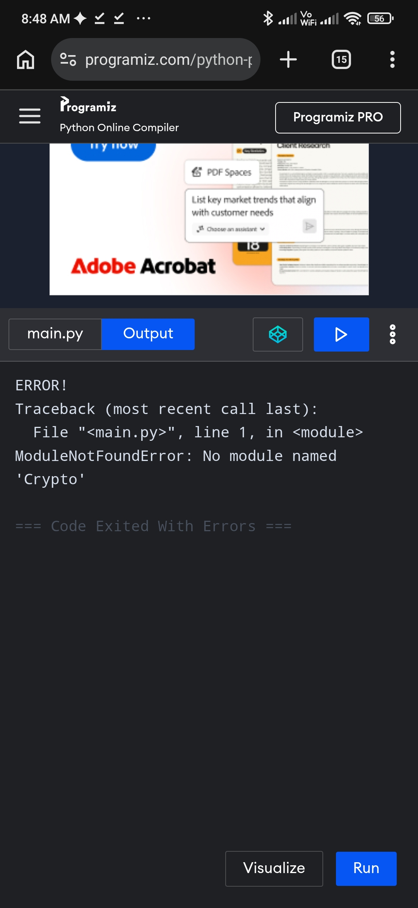

# UrbanGuard Resilience Engine

<div align="center">

```text
  _   _rb2nGuard  ____            __ _                          
 | | | |_ __| |  / ___| _  _  _ _| | |_                          
 | | | | '__| | | |  _| | || || | _||  _|                        
 | |_| | |  | | | |_| | |_|| || | |_| |_                         
  \___/|_|  |_|  \____|\__,_|\__|\__|\__|                        

Offline-First Peer-to-Peer Disaster Response Platform & Spatial Risk Perimeter Network
License: MIT

Platform

Build Status

Release
Features • Architecture • Quickstart • UI Showcase • API Reference • CLI Tools
</div>
📌 Overview
UrbanGuard is a portable, production-grade disaster resilience stack designed for infrastructure-degraded and offline environments. Running natively on Android via Termux and Flutter, UrbanGuard combines local SQLite R-Tree spatial storage, a UDP multi-hop mesh network, and self-healing watchdog supervisors to keep critical hazard intelligence flowing when centralized networks fail.
Whether mapping live perimeter threat zones (Flood, Power Grid Failures, Substation Transformer Fires) or sync-broadcasting hazard mutations peer-to-peer, UrbanGuard provides localized, zero-trust situational awareness without internet connectivity.
🖼️ UI Showcase
<div align="center">
Live Risk Perimeter & Spatial Hazard Tracking

Real-time spatial risk mapping displaying active hazards (e.g., Substation Transformer Fire in Richmond), radius perimeters, and category filter chips (ALL, FLOOD, GRID, FIRE).
</div>
✨ Core Features
| Feature | Description |
|---|---|
| 🛡️ Offline-First Spatial Mapping | Embedded R-Tree spatial indexing powered by SQLite for sub-millisecond geofencing and threat perimeter queries. |
| 📡 P2P Mesh Networking | Ad-hoc UDP datagram broadcasting on port :9090 over local Wi-Fi and Wi-Fi Direct peer networks. |
| 🔄 IPC Mutation Queue | Linux Named Pipe FIFO ($TMPDIR/urbanguard_mesh.fifo) decoupled worker pipeline for non-blocking mutation ingestion. |
| 🩺 Self-Healing Watchdog | Process supervisor running background health checks every 30 seconds to restart failed microservices. |
| 🔐 Cryptographic Backups | Scheduled crontab PBKDF2 AES-256-CBC database backups and Ed25519 payload attestation. |
| ⚡ Cross-Platform Bridge | Flutter frontend UI connected to local Termux microservice endpoints via internal loopback (http://127.0.0.1:8080). |
🏗️ System Architecture
                                  +---------------------------------------+
                                  |     UrbanGuard Mobile Frontend        |
                                  |         (Flutter / Dart UI)           |
                                  +-------------------+-------------------+
                                                      |
                                           REST API   | HTTP :8080
                                                      v
+-------------------------------------------------------------------------------------------------+
| Termux Runtime Environment (ARM64)                                                              |
|                                                                                                 |
|   +--------------------------+       JSON IPC Pipe        +----------------------------------+  |
|   |   Python REST Server     | -------------------------> |    Named Pipe FIFO Sync Worker   |  |
|   |     (:8080 Endpoint)     |  $TMPDIR/urbanguard_mesh   |   (Mutation Queue Ingestion)     |  |
|   +------------+-------------+                            +----------------+-----------------+  |
|                |                                                           |                    |
|                v                                                           v                    |
|   +--------------------------+                            +----------------------------------+  |
|   |  SQLite R-Tree Storage   |                            |       UDP P2P Mesh Router        |  |
|   |      (hazards.db)        |                            |    (Broadcast 0.0.0.0:9090)      |  |
|   +--------------------------+                            +----------------+-----------------+  |
|                ^                                                           |                    |
|                |                   30s Health Inspection                   |                    |
|                +------------------ [Watchdog Supervisor] <-----------------+                    |
+-------------------------------------------------------------------------------------------------+
                                             |
                                  UDP Broadcast Mesh Frame
                                             v
                                  +-----------------------+
                                  |  Nearby Mesh Nodes    |
                                  |    (Peer Devices)     |
                                  +-----------------------+

🚀 Quickstart
Prerequisites
 * Android Device (ARM64 recommended)
 * Termux Environment (pkg install python git sqlite openjdk-17 -y)
 * Flutter SDK (For frontend compilation)
One-Command Quickstart (Termux Engine Deployment)
# Clone the official repository
git clone [https://github.com/STARSKING1/urbanguard.git](https://github.com/STARSKING1/urbanguard.git)
cd urbanguard

# Launch production microservices stack
bash 15_run_production_stack.sh

💻 CLI & TUI Control
UrbanGuard comes with a built-in interactive Terminal User Interface (TUI) and diagnostic suite installed directly to $PREFIX/bin:
# Launch interactive TUI control dashboard
urbanguard

# Stream live aggregated multi-daemon logs
urbanguard logs

# Execute on-demand AES-256 encrypted database backup
urbanguard backup

# Run system maintenance, SQLite VACUUM, and log rotation
urbanguard maintain

# Run full system health audit
urbanguard audit

Dashboard Output Sample
================================================================================
      URBANGUARD RESILIENCE ENGINE v1.0.0 - FIELD CONTROL DASHBOARD             
================================================================================
[ NODE TELEMETRY & SERVICES ]
  • Host Platform:      Termux / Android (ARM64)
  • REST Spatial API:   [http://127.0.0.1:8080](http://127.0.0.1:8080) [ONLINE - 200 OK]
  • P2P Mesh Router:    UDP 255.255.255.255:9090 [LISTENING]
  • Self-Healing Watch: ACTIVE (PID 18420)
  • Mutation Sync:      ACTIVE (PID 18425)
  • Primary Database:   hazards.db [HEALTHY - 2 Active Hazards]

[ ACTIVE SPATIAL HAZARDS ]
  • [h1] Flash Flood Warning    | Lat: 12.9716, Lng: 77.5946 | Category: Flood
  • [h2] Seismic Tremor Alert  | Lat: 12.9800, Lng: 77.6000 | Severity: CRITICAL
================================================================================

📡 API Reference
Get Active Spatial Hazards
GET [http://127.0.0.1:8080/](http://127.0.0.1:8080/)

Response (200 OK)
{
  "status": "ONLINE",
  "node_id": "NODE_ALPHA",
  "hazards_count": 2,
  "hazards": [
    {
      "hazard_id": "h1",
      "title": "Flash Flood Warning",
      "category": "Flood",
      "severity": "HIGH",
      "latitude": 12.9716,
      "longitude": 77.5946
    },
    {
      "hazard_id": "h2",
      "title": "Substation Transformer Fire",
      "category": "Fire",
      "severity": "HIGH",
      "latitude": 12.9650,
      "longitude": 77.6010
    }
  ]
}

📥 APK Installation
Download pre-compiled release binaries built via GitHub Actions:
 * Navigate to UrbanGuard Releases.
 * Download UrbanGuard-v1.0.0-universal.apk.
 * Install on your Android device.
📄 License
This project is licensed under the MIT License — see the LICENSE file for details.
